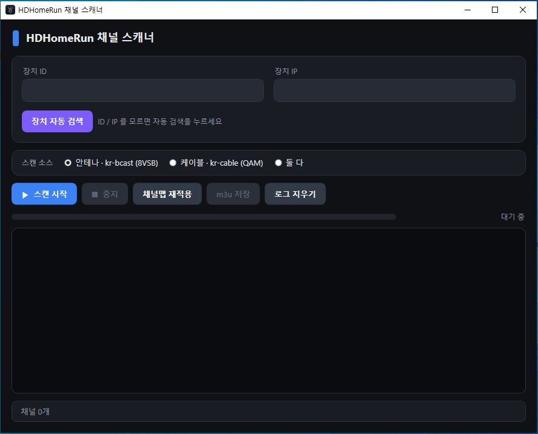

# 📡 HDHomeRun 채널 스캐너

> 안테나/케이블 채널을 스캔해 재생 가능한 m3u 재생목록을 만들어 주는 Windows 프로그램

HDHomeRun 튜너로 한국 방송/케이블 채널을 스캔해서, 현재 펌웨어에서 바로 재생되는 m3u 재생목록을 생성합니다. VLC·Jellyfin·Plex·팟플레이어 등에서 이 재생목록으로 TV를 볼 수 있습니다.

---

## 목차

- [준비물](#준비물)
- [설치 및 실행](#설치-및-실행)
- [화면 구성](#화면-구성)
- [사용법](#사용법)
- [버튼 설명](#버튼-설명)
- [채널이 안 나올 때: 채널맵 재적용](#채널이-안-나올-때-채널맵-재적용)
- [문제 해결](#문제-해결)

---

## 준비물

- **HDHomeRun 튜너** (CONNECT QUATRO 등)와 PC가 **같은 네트워크(같은 공유기)** 에 연결
- **.NET 8 Desktop Runtime** 설치 (아래 [실행 요구 사항](#️-실행-요구-사항-net-8-desktop-runtime) 참고)

---

## 실행

1. 세 파일(`HDHomeRun Scan.exe`, `hdhomerun_config_custom.exe`, `cygwin1.dll`)을 다운로드합니다.
3. `HDHomeRun Scan.exe` 를 더블클릭해 실행합니다.

> Windows에서 "알 수 없는 게시자" 경고가 뜨면 **추가 정보 → 실행**을 눌러 진행하세요.

---

## ⚙️ 실행 요구 사항: .NET 8 Desktop Runtime

PC에 **.NET 8 Desktop Runtime**이 설치돼 있어야 합니다.

> 설치돼 있지 않으면 실행 시 *"이 애플리케이션을 실행하려면 .NET을 설치해야 합니다"* 안내창이 뜹니다. 아래 방법 중 하나로 설치하세요.

### 공식 페이지에서 다운로드

1. [.NET 8.0 다운로드 페이지](https://dotnet.microsoft.com/en-us/download/dotnet/8.0) 접속
2. **.NET Desktop Runtime** 항목에서 **Windows · x64** 설치 파일 다운로드
   - SDK나 ASP.NET Core Runtime이 아니라 **Desktop Runtime**을 받아야 합니다
3. 받은 파일을 실행해 설치

---

## 화면 구성

| 영역 | 설명 |
|---|---|
| **장치 ID / IP** | 대상 HDHomeRun의 식별자와 주소. 모르면 아래 자동 검색으로 채웁니다 |
| **장치 자동 검색** | 네트워크의 HDHomeRun을 찾아 ID·IP를 자동 입력 |
| **스캔 소스** | 안테나(8VSB) / 케이블(QAM) / 둘 다 선택 |
| **진행 바 · 상태** | 스캔 진행 상황, 현재 주파수, 발견 채널 수 표시 |
| **로그 창** | 스캔 과정이 실시간으로 출력 |
| **하단 표시** | 지금까지 찾은 채널 개수 |

---

## 사용법

1. **장치 찾기** — `장치 자동 검색`을 눌러 ID·IP를 자동 입력 (알고 있으면 직접 입력)
2. **소스 선택** — 한국 케이블/지상파는 대부분 **안테나(kr-bcast · 8VSB)**. 모르면 `둘 다`
3. **스캔 시작** — `▶ 스캔 시작` 클릭 → 스캔이 진행됩니다 (수 분 소요)
4. **결과 확인** — 로그에 채널이 쌓이고 하단에 "채널 N개"가 표시. 끝나면 상태가 "완료"로 변경
5. **저장** — `m3u 저장`을 눌러 재생목록 파일로 저장

---

## 버튼 설명

| 버튼 | 기능 |
|---|---|
| `장치 자동 검색` | 네트워크에서 HDHomeRun을 찾아 ID·IP 자동 입력 (여러 대면 첫 장치로 설정) |
| `▶ 스캔 시작` | 채널 스캔 시작, 로그 실시간 표시 및 채널 집계 |
| `■ 중지` | 진행 중인 스캔 즉시 중단 |
| `채널맵 재적용` | 재스캔 없이 튜너 설정만 복구 (재부팅 후 채널이 안 나올 때) |
| `m3u 저장` | 찾은 채널을 재생목록으로 저장 (채널번호순 정렬, 불필요 채널 자동 제외) |
| `로그 지우기` | 로그 창 비우기 |

---

## 채널이 안 나올 때: 채널맵 재적용

정전이나 장치 재부팅 후 **스캔은 잘 되는데 재생이 안 되는** 경우가 있습니다. 장치가 재부팅되면서 튜너 설정이 초기화됐기 때문입니다.

이럴 때 **재스캔할 필요 없이** `채널맵 재적용` 버튼 한 번만 누르면 즉시 복구됩니다. 스캔 소스(안테나/케이블)를 원래대로 선택한 뒤 누르세요.

> 💡 스캔이 안 될 때가 아니라, "스캔은 되는데 재생만 안 될 때" 쓰는 버튼입니다.

---

## 문제 해결

| 증상 | 확인 / 해결 |
|---|---|
| **자동 검색이 장치를 못 찾음** | PC와 장치가 같은 네트워크인지 확인 · Windows 방화벽에서 프로그램 허용 · 안 되면 ID·IP 직접 입력 |
| **스캔은 되는데 재생이 안 됨** | 재부팅으로 설정이 풀린 것 → 소스 선택 후 `채널맵 재적용` |
| **채널이 하나도 안 잡힘** | 스캔 소스가 맞는지 확인(안테나↔케이블) · 바꿔서 재스캔하거나 `둘 다` 선택 |
| **실행 시 오류 / 스캔이 안 됨** | `hdhomerun_config_custom.exe`·`cygwin1.dll`이 exe와 같은 폴더에 있는지 확인 |
| **로그가 비어 있음** | 장치 IP가 정확한지, 장치 전원·네트워크 연결 상태 확인 |

---

HDHomeRun 채널 스캐너 · 20260326 펌웨어 기준 · 개인 사용 목적 ·  본프로그램 사용시 문제 발생은 사용자에게 있습니다
